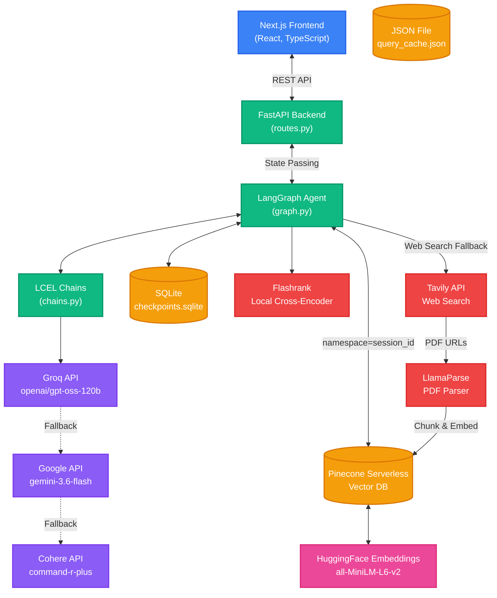
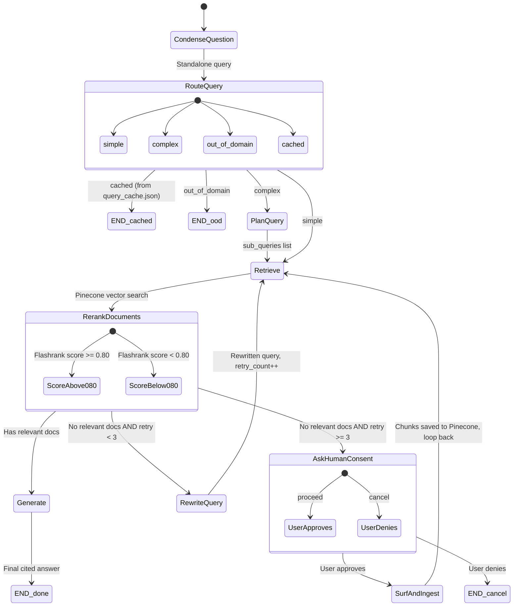
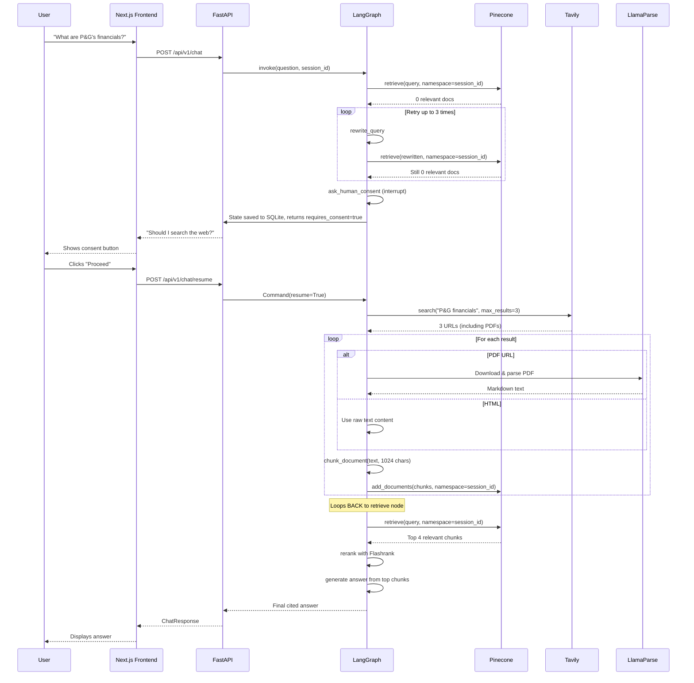
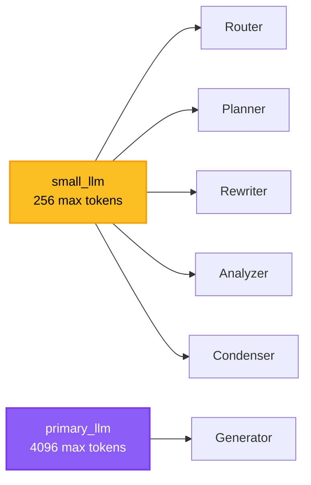

# FinSight Architecture & Workflows

> [!IMPORTANT]
> **Last Verified**: 2 Aug 2026 — Audited line-by-line against the live codebase.

FinSight is an Agentic RAG (Retrieval-Augmented Generation) system for financial analysis. It uses LangGraph for orchestration, LangChain for model interactions, and a multi-tiered LLM fallback system.

---

## 1. High-Level System Architecture



---

## 2. Tech Stack (Verified)

| Layer | Technology | Details |
|-------|-----------|---------|
| **Frontend** | Next.js 15, React, TypeScript | Chat UI with session management |
| **Backend API** | FastAPI (Python) | REST endpoints, CORS |
| **Orchestration** | LangGraph + LangChain | Stateful agent graph with checkpointing |
| **Primary LLM** | Groq Cloud — `openai/gpt-oss-120b` | Final answer generation (4096 max tokens) |
| **Fallback LLM** | Google — `gemini-3.6-flash` | Used in `.with_fallbacks()` chain |
| **Fallback LLM 2** | Cohere — `command-r-plus` | Third-tier fallback |
| **Embeddings** | HuggingFace — `all-MiniLM-L6-v2` | Local model, NOT Google API |
| **Vector Database** | Pinecone Serverless | Namespace-per-session isolation |
| **Sparse Retrieval** | BM25 (rank_bm25) | Currently disabled (empty doc list on init) |
| **Reranking** | Flashrank | Local cross-encoder, score threshold 0.80 |
| **Doc Parsing** | Docling (local PDFs), LlamaParse (uploads + web) | Markdown conversion |
| **Web Search** | Tavily API | `search_depth="advanced"`, max 3 results |
| **Checkpointing** | SQLite (`checkpoints.sqlite`) | Session persistence + HITL interrupts |
| **Caching** | `query_cache.json` | Exact-match query cache |
| **Observability** | Langfuse | Tracing (configured but optional) |

> [!WARNING]
> **BM25 is effectively disabled.** In [dependencies.py](file:///home/kuldeep-joshi/Desktop/finsight/src/finsight/api/dependencies.py#L32-L34), the `HybridRetriever` is initialized with `documents=[]`. This means BM25 sparse search returns 0 results every time. Only Pinecone vector search is active. This is intentional for Pinecone Serverless (we can't easily scroll all docs to build a local BM25 index), but the retriever class comments still reference "hybrid" behavior.

> [!NOTE]
> **Embedding Model Mismatch in settings.py**: The [settings.py](file:///home/kuldeep-joshi/Desktop/finsight/config/settings.py#L86-L93) file defines `embedding_model = "models/text-embedding-004"` and `embedding_dimension = 768`, which are Google Gemini settings. However, the actual [embeddings.py](file:///home/kuldeep-joshi/Desktop/finsight/src/finsight/utils/embeddings.py#L57-L67) module uses `HuggingFaceEmbeddings(model_name=resolved_model)`, which resolves to the settings value but treats it as a HuggingFace model name. In practice, `all-MiniLM-L6-v2` appears to be used (based on the import and default behavior), but the config string may need cleanup.

---

## 3. Core Modules

### [routes.py](file:///home/kuldeep-joshi/Desktop/finsight/src/finsight/api/routes.py) — API Gateway
| Endpoint | Method | Purpose |
|----------|--------|---------|
| `/api/v1/chat` | POST | Main chat. Creates a `thread_id` (UUID), invokes graph, detects HITL interrupts |
| `/api/v1/chat/resume` | POST | Resumes a paused graph after human consent |
| `/api/v1/upload` | POST | Uploads a PDF → LlamaParse → chunk → Pinecone (namespace = `thread_id`) |
| `/api/v1/sessions` | GET | Lists all session thread IDs from SQLite |
| `/api/v1/sessions/{thread_id}` | GET | Fetches full chat history for a session |

### [graph.py](file:///home/kuldeep-joshi/Desktop/finsight/src/finsight/agents/graph.py) — The Brain (State Machine)
Defines the LangGraph `StateGraph` with 9 nodes and conditional edges. Manages `AgentState` with fields like `question`, `documents`, `generation`, `retry_count`, `session_id`, `chat_history`.

### [chains.py](file:///home/kuldeep-joshi/Desktop/finsight/src/finsight/rag/chains.py) — LLM Skills (LCEL Chains)
7 chains, each with a specialized system prompt:
1. **RewriterChain** — Rewrites failed queries with SEC filing terminology
2. **GeneratorChain** — Produces grounded, cited answers (10 strict rules)
3. **RouterChain** — Classifies: `simple` / `complex` / `out_of_domain`
4. **PlannerChain** — Decomposes complex queries into ≤5 sub-queries
5. **QueryAnalyzerChain** — Extracts metadata filters (`ticker`, `fiscal_year`, `type`)
6. **CondenserChain** — Resolves conversational references using chat history
7. **GraderChain** — (Defined in `build_all_chains` but **NOT used** in `graph.py`. Reranking via Flashrank replaced LLM-based grading.)

### [dependencies.py](file:///home/kuldeep-joshi/Desktop/finsight/src/finsight/api/dependencies.py) — Factory
Creates and caches three LLM instances:
- `primary_llm` = `get_llm_with_fallback()` → 4096 max tokens
- `small_llm` = `get_llm_with_fallback(max_tokens=256)` → 256 max tokens
- `fallback_llm` = `get_fallback_llm()` → created but **NOT passed** to `build_rag_agent` (line 38: `fallback_llm=None`)

### [retriever.py](file:///home/kuldeep-joshi/Desktop/finsight/src/finsight/rag/retriever.py) — Hybrid Search
Implements `HybridRetriever` with RRF fusion. Currently operates as **pure vector search** (BM25 disabled due to empty doc init).

### [web_surfer.py](file:///home/kuldeep-joshi/Desktop/finsight/src/finsight/tools/web_surfer.py) — Web Search Tool
Uses Tavily for web search → downloads PDFs via LlamaParse or ingests raw HTML → chunks via `chunk_document()` → stores in Pinecone under the session namespace.

---

## 4. The Agentic Workflow (LangGraph State Machine)



### Node Details

| Node | LLM Used | Max Tokens | Purpose |
|------|----------|------------|---------|
| `condense_question` | `small_llm` (routing_llm) | 256 | Resolves "their", "it", etc. using chat history |
| `route_query` | `small_llm` (routing_llm) | 256 | Classifies: simple/complex/out_of_domain. Also checks query cache. |
| `plan_query` | `small_llm` (planning_llm) | 256 | Breaks complex queries into ≤5 sub-queries |
| `retrieve` | None (no LLM) | — | Calls `HybridRetriever.retrieve()` against Pinecone (namespace=session_id) |
| `rerank_documents` | None (no LLM) | — | Flashrank cross-encoder. Top 4, threshold 0.80 |
| `rewrite_query` | `small_llm` (planning_llm) | 256 | Rewrites failed queries with SEC terminology |
| `ask_human_consent` | None | — | LangGraph `interrupt()`. Pauses execution, saves state to SQLite |
| `surf_and_ingest_node` | None (no LLM) | — | Tavily search → LlamaParse → chunk → Pinecone. Loops back to `retrieve` |
| `generate` | `primary_llm` | 4096 | Final answer with inline citations. Context hard-capped at 16K chars |

> [!TIP]
> **The "Grader" is NOT an LLM call.** The old architecture used an LLM-based grader chain to judge document relevance. The current implementation replaced this with **Flashrank** (a local cross-encoder model), which is faster, free, and doesn't consume API tokens. The `build_grader_chain` function still exists in `chains.py` but is only referenced in `build_all_chains()` — it is **never called** by `graph.py`.

---

## 5. Data Flow: Web Search Pipeline (Fixed)

When the local Pinecone database has no relevant documents:



> [!IMPORTANT]
> **Key Fix (2 Aug 2026)**: The web search node now loops back to the `retrieve` node after ingesting to Pinecone, instead of dumping all raw chunks directly into the generator. This prevents the 413 Token Limit error that occurred with massive documents like P&G's 300-page Annual Report.

---

## 6. Token & Cost Optimization

### Split-Brain LLM Architecture



**Why?** Groq's free tier tracks token usage via a "Tokens Per Minute" bucket. Every API call reserves `max_tokens` from the bucket upfront, even if the model only generates 20 tokens. By giving internal agents a 256-token cap, we prevent them from burning 4K tokens each.

### Context Truncation Safety Net
In [graph.py line 448-452](file:///home/kuldeep-joshi/Desktop/finsight/src/finsight/agents/graph.py#L448-L452), the combined context string fed to the generator is hard-capped at 16,000 characters (~4,000 tokens). This prevents API crashes even if retrieval returns unexpectedly large chunks.

### Resilient Fallback Chain
The `get_llm_with_fallback()` function wraps the primary Groq model with LangChain's `.with_fallbacks()`:
```
Groq (gpt-oss-120b) → Gemini (3.6-flash) → Cohere (command-r-plus)
```
If Groq throws a 429/500 error, the request seamlessly falls through.

---

## 7. Session & Namespace Isolation

Each chat session gets a unique `thread_id` (UUID). This ID is used in two places:
1. **Pinecone Namespace**: All documents (uploaded PDFs, web search results) are stored under `namespace=thread_id`. Retrieval only searches within that namespace.
2. **SQLite Checkpointer**: LangGraph saves the full agent state (chat history, documents, generation) keyed by `thread_id`. This enables session persistence and HITL resume.

---

## 8. Known Issues & Inconsistencies Found During Audit

| Issue | File | Details |
|-------|------|---------|
| **Stale import** | [graph.py L48](file:///home/kuldeep-joshi/Desktop/finsight/src/finsight/agents/graph.py#L48) | `from langgraph.checkpoint.memory import MemorySaver` is imported but never used (we use `SqliteSaver` now) |
| **Stale docstring** | [graph.py L1-37](file:///home/kuldeep-joshi/Desktop/finsight/src/finsight/agents/graph.py#L1-L37) | Module docstring still shows the old flow diagram without `condense_question`, `ask_human_consent`, or `surf_and_ingest_node` |
| **Unused GraderChain** | [chains.py L377](file:///home/kuldeep-joshi/Desktop/finsight/src/finsight/rag/chains.py#L377) | `build_all_chains()` builds a grader chain, but `graph.py` never uses it (Flashrank replaced it) |
| **Unused fallback_llm** | [dependencies.py L29](file:///home/kuldeep-joshi/Desktop/finsight/src/finsight/api/dependencies.py#L29) | `fallback_llm = get_fallback_llm()` is instantiated but passed as `None` to `build_rag_agent` |
| **Stale retriever docstring** | [retriever.py L1-12](file:///home/kuldeep-joshi/Desktop/finsight/src/finsight/rag/retriever.py#L1-L12) | Module docstring references "Qdrant" but we use Pinecone |
| **Stale PROJECT_CONTEXT.md** | [PROJECT_CONTEXT.md L13](file:///home/kuldeep-joshi/Desktop/finsight/PROJECT_CONTEXT.md#L13) | References "Qdrant Cloud" — should be "Pinecone Serverless" |
| **Stale PROJECT_CONTEXT.md** | [PROJECT_CONTEXT.md L12](file:///home/kuldeep-joshi/Desktop/finsight/PROJECT_CONTEXT.md#L12) | Says embeddings are "Google Gemini text-embedding-004" — actual code uses HuggingFace |
| **Stale PROJECT_CONTEXT.md** | [PROJECT_CONTEXT.md L26](file:///home/kuldeep-joshi/Desktop/finsight/PROJECT_CONTEXT.md#L26) | Says "Llama 3.1 70B" — actual model is `openai/gpt-oss-120b` |
| **Embedding config mismatch** | [settings.py L86-88](file:///home/kuldeep-joshi/Desktop/finsight/config/settings.py#L86-L88) | Config says `models/text-embedding-004` (Google format) but embeddings.py uses HuggingFace |
