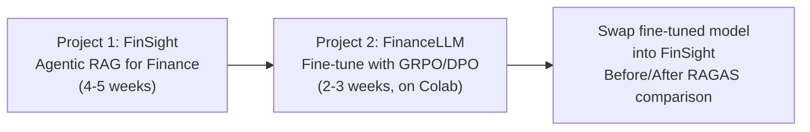
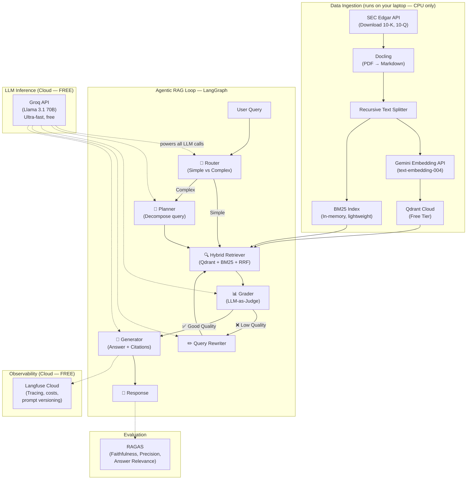
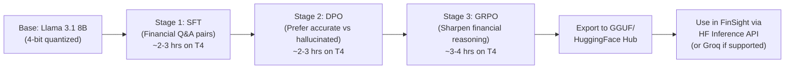

# 🏗️ Implementation Plan: FinSight — Finance ML Portfolio

> **Your constraints**: No local GPU/RAM, zero budget, no credit card risk  
> **Solution**: 100% cloud-based stack using genuinely free tiers (no credit card required anywhere)

---

## 💰 Safety-First: The $0 Stack (Verified June 2026)

> [!CAUTION]
> Every service below has been verified to be **genuinely free** with **no credit card required**. No trial periods that auto-convert to paid. No surprise charges. You can sign up with just an email/Google account.

| Service | What It Does | Free Tier Limits | Credit Card? | Risk of Charges |
|---------|-------------|-----------------|-------------|----------------|
| **Groq API** | LLM inference (Llama 3.1, Qwen3) | Rate-limited RPM/TPM, unlimited time | ❌ Not required | ✅ Zero — no payment method on file |
| **Google Gemini API** (AI Studio) | Embeddings + backup LLM | Rate-limited RPM/TPD, unlimited time | ❌ Not required | ✅ Zero — never enable GCP billing |
| **Qdrant Cloud** | Vector database | 1GB RAM, 4GB disk (~1M vectors), forever | ❌ Not required | ✅ Zero — permanent free tier |
| **Langfuse Cloud** | LLM observability & tracing | 50K traces/month, 30-day retention | ❌ Not required | ✅ Zero — Hobby tier is permanent |
| **Google Colab** | GPU for fine-tuning (T4 16GB) | ~15-30 hrs/week GPU, 12hr sessions | ❌ Not required | ✅ Zero — separate from GCP billing |
| **HuggingFace** | Model hosting, datasets, Spaces | Free inference credits, free Spaces | ❌ Not required | ✅ Zero — free tier is permanent |
| **Weights & Biases** | Experiment tracking | Unlimited personal projects | ❌ Not required | ✅ Zero — free for individuals |
| **GitHub** | Code hosting | Unlimited public repos | ❌ Not required | ✅ Zero |

> [!IMPORTANT]
> **Critical rule for Gemini API**: Use it ONLY through **Google AI Studio** (aistudio.google.com). Do NOT enable billing on a Google Cloud project — that would disable the free tier. Keep AI Studio and GCP completely separate.

---

## Two Projects, One Connected Vision

---

## Project 1: FinSight — Agentic RAG for Financial Intelligence

### What You're Building

A production-grade **agentic RAG system** for SEC filings and financial documents. Users ask questions, and the system uses an agentic loop (LangGraph) to plan, retrieve, self-correct, and generate grounded answers with citations.

### Cloud-Native Architecture

### Why This Stack Is Perfect For You

| Concern | How It's Addressed |
|---------|-------------------|
| **No GPU/RAM** | All LLM inference via Groq cloud API. Embeddings via Gemini API. Vector DB on Qdrant Cloud. Your laptop only runs lightweight Python. |
| **No credit card** | Every service verified: email signup only |
| **No surprise charges** | No payment method on file anywhere = physically impossible to be charged |
| **Learning new frameworks** | LangGraph + LangChain — completely new for you (vs ADK experience) |
| **Finance domain** | SEC filings, earnings reports, financial analysis |
| **Interview-ready** | #1 most asked-about project type in 2026 |

### What Runs Where

| Component | Where It Runs | Resource Needed |
|-----------|--------------|----------------|
| Python code, LangGraph logic | Your laptop | Basic CPU, ~2GB RAM (just Python) |
| LLM inference | Groq Cloud | Nothing local — API calls |
| Embeddings | Google Gemini API | Nothing local — API calls |
| Vector storage | Qdrant Cloud | Nothing local — cloud hosted |
| Observability | Langfuse Cloud | Nothing local — cloud hosted |
| Fine-tuning (Project 2) | Google Colab | Nothing local — browser-based |
| Demo UI (Streamlit) | Your laptop / HF Spaces | Minimal CPU |

---

### Week-by-Week Plan (~20 hrs/week)

#### Week 1: Foundation — Data Pipeline + Basic RAG
**Goal**: Get documents in, get basic retrieval working end-to-end

- [ ] Set up project (Python venv, Git repo, `.env` for API keys)
- [ ] Sign up for free accounts: Groq, Google AI Studio, Qdrant Cloud, Langfuse
- [ ] Build SEC filing downloader (`sec-edgar-downloader` library)
- [ ] Build document parser with Docling (PDF → structured markdown with tables)
- [ ] Implement chunking (recursive text splitter with metadata: company, year, filing type)
- [ ] Connect to Gemini Embedding API (`text-embedding-004`)
- [ ] Ingest chunks into Qdrant Cloud
- [ ] Build **basic naive RAG chain** with LangChain + Groq (retrieve → generate)
- [ ] Test with 3-5 sample SEC filings (Apple, Tesla, Google)

**You'll learn**: LangChain document loaders, text splitters, embedding models, Qdrant vector operations, Groq API integration

---

#### Week 2: Hybrid Search + Agentic Loop (LangGraph)
**Goal**: Transform naive RAG into intelligent agentic RAG

- [ ] Add BM25 sparse retriever (in-memory, lightweight — `rank-bm25` library)
- [ ] Implement **Reciprocal Rank Fusion (RRF)** to merge vector + keyword results
- [ ] Build the LangGraph `StateGraph`:
  - **Router node**: classify query as simple vs complex
  - **Planner node**: decompose complex queries into sub-queries
  - **Retriever node**: hybrid search (Qdrant vectors + BM25 keywords + RRF merge)
  - **Grader node**: LLM-as-Judge — score retrieved chunks for relevance
  - **Rewriter node**: Corrective RAG — rewrite query on low relevance scores
  - **Generator node**: produce grounded answer with statement-level citations
- [ ] Add conditional edges with retry limits (max 3 correction loops)
- [ ] Add `interrupt_before` for human-in-the-loop on high-stakes queries
- [ ] Test with multi-hop financial questions

**You'll learn**: LangGraph state management, StateGraph, conditional edges, checkpointing, Corrective RAG pattern, hybrid retrieval, RRF algorithm

---

#### Week 3: Evaluation + Observability + Hardening
**Goal**: Make it measurable, debuggable, and production-grade

- [ ] Create gold-standard eval set (20-30 financial Q&A pairs with expected answers)
- [ ] Integrate **RAGAS** evaluation:
  - Faithfulness — does answer match retrieved context?
  - Context Precision — is retrieved context actually relevant?
  - Answer Relevance — does answer address the question?
- [ ] Integrate **Langfuse** tracing:
  - Trace every agent node (router → planner → retriever → grader → generator)
  - Track token usage, latency, and cost per query
  - Set up prompt versioning for system prompts
- [ ] Add **statement-level attribution** (each claim linked to source chunk)
- [ ] Add metadata filtering (filter by company ticker, fiscal year, filing type)
- [ ] Error handling: graceful fallbacks when Groq rate-limited
- [ ] Build automated eval pipeline (script that runs full eval suite)

**You'll learn**: RAGAS evaluation framework, LLM observability with Langfuse, building eval datasets, production error handling

---

#### Week 4: API + UI + Deployment
**Goal**: Make it impressive and demo-ready

- [ ] Build **FastAPI** backend:
  - `POST /query` — ask a financial question
  - `POST /ingest` — upload new documents
  - `GET /companies` — list ingested companies
  - `GET /health` — health check
- [ ] Build **Streamlit** frontend:
  - Chat interface with expandable source citations
  - Company/ticker selector dropdown
  - Document upload panel
  - Langfuse trace viewer link per query
  - RAGAS evaluation dashboard
- [ ] Add conversation memory (multi-turn financial analysis)
- [ ] Write comprehensive README:
  - Architecture diagram
  - Setup instructions
  - Design trade-offs documented
  - Live demo link
- [ ] Deploy demo to **HuggingFace Spaces** (free, no credit card)

**You'll learn**: FastAPI, Streamlit, HuggingFace Spaces deployment, API design, building a portfolio-ready README

---

#### Week 5 (Buffer/Polish):
- [ ] Docker-compose setup (for reproducibility, even if not deployed to cloud)
- [ ] Performance tuning: async API calls, caching frequent queries
- [ ] Write a blog post explaining the architecture
- [ ] Record a 3-minute demo video
- [ ] Clean up GitHub repo, add CI tests

---

## Project 2: FinanceLLM — Fine-Tuning with GRPO/DPO (Google Colab)

### What You're Building

Fine-tune Llama 3.1 8B into a **financial reasoning specialist** using the modern SFT → DPO → GRPO pipeline. Everything runs on **Google Colab free tier** (T4 GPU) with **Unsloth** for memory efficiency.

### Why Colab Is Safe

| Concern | Answer |
|---------|--------|
| Credit card? | ❌ Not required for Colab free tier |
| Auto-upgrade to paid? | ❌ No — free and paid are separate products |
| GPU limits? | ~15-30 hrs/week, T4 16GB — enough for LoRA fine-tuning |
| Session disconnect? | Yes, save checkpoints to Google Drive every 30 mins |
| Confusion with GCP? | They're different products — Colab ≠ Google Cloud |

### The Fine-Tuning Pipeline

### Week-by-Week Plan

#### Week 6: SFT + DPO (on Colab)
- [ ] Curate financial dataset from HuggingFace (FinQA, ConvFinQA, SEC-QA)
- [ ] Set up Unsloth notebook on Colab (use official templates)
- [ ] Stage 1: **SFT** — supervised fine-tuning on financial Q&A (LoRA, 4-bit)
- [ ] Create preference pairs (accurate vs hallucinated financial answers)
- [ ] Stage 2: **DPO** — direct preference optimization
- [ ] Track experiments on Weights & Biases (free tier)
- [ ] Compare: base model vs SFT vs SFT+DPO on financial benchmarks

#### Week 7: GRPO + Integration
- [ ] Design reward function (verifiable: correct numbers, calculations, citations)
- [ ] Stage 3: **GRPO** — group relative policy optimization
- [ ] Full comparison: Base → SFT → DPO → GRPO (show progressive improvement)
- [ ] Upload fine-tuned model to HuggingFace Hub
- [ ] **Swap into FinSight RAG** — use via HF Inference API
- [ ] Run same RAGAS eval suite — show before/after improvement
- [ ] Write blog post: "Fine-Tuning a Financial LLM with GRPO on Free Hardware"

---

## Open Questions

> [!NOTE]
> **Stock Price Data**: Want to also pull real-time stock prices via free APIs (Yahoo Finance — no API key needed)? This would let users ask things like *"How did Apple's stock react when they reported declining iPhone revenue in Q3 2025?"* — combining document analysis with market data. We can add this in Week 4-5 if you're interested.

> [!WARNING]
> **Rate Limits Strategy**: Groq free tier has rate limits (RPM/TPM). For development this is fine, but if you demo it live and hit limits, the app should gracefully handle it. I'll build automatic fallback to Gemini Flash API (also free) so queries never fail. Sound good?

---

## Verification Plan

### Automated
- RAGAS eval suite (20-30 financial Q&A gold standard)
- Unit tests per LangGraph node
- Integration test for full agentic loop
- Before/after comparison with fine-tuned model

### Manual
- Live demo with complex multi-hop financial queries
- Langfuse trace inspection
- HuggingFace Spaces deployment verification

---

## What You'll Learn (All New Skills)

| From Project 1 | From Project 2 |
|----------------|---------------|
| LangGraph (vs your ADK experience) | Supervised Fine-Tuning (SFT) |
| LangChain document processing | DPO alignment |
| Hybrid search (Vector + BM25 + RRF) | GRPO reasoning optimization |
| Corrective RAG (self-grading) | Unsloth + LoRA (efficient training) |
| RAGAS evaluation framework | Model benchmarking & comparison |
| Langfuse LLM observability | HuggingFace model publishing |
| FastAPI + Streamlit | Weights & Biases experiment tracking |
| Qdrant vector database | Quantization (4-bit training) |
| Groq + Gemini API integration | |

---

## Summary

| | Project 1: FinSight | Project 2: FinanceLLM |
|---|---|---|
| **Type** | Agentic RAG System | LLM Fine-Tuning |
| **Runs on** | Your laptop (lightweight Python) + cloud APIs | Google Colab (browser) |
| **LLM** | Groq API (free) | Unsloth on Colab (free T4) |
| **Time** | 4–5 weeks | 2–3 weeks |
| **Total cost** | **$0** | **$0** |
| **Credit cards** | **None anywhere** | **None anywhere** |
