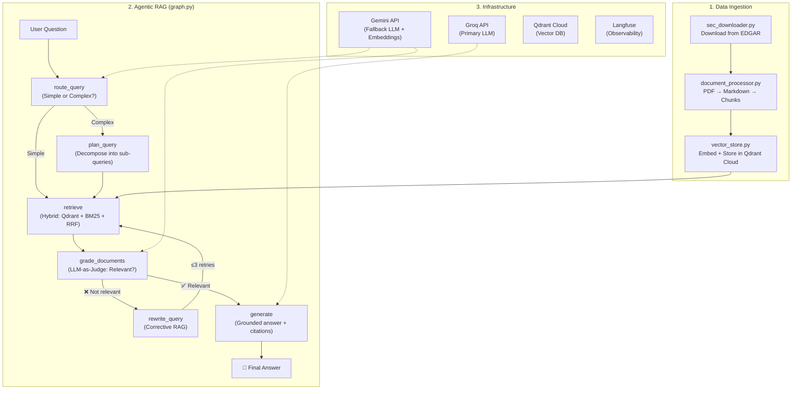

# 🏗️ FinSight — Build Walkthrough

> What was built, how it works, and what to do next.

---

## Project Structure

```
finsight/
├── README.md                          # Project overview + setup guide
├── requirements.txt                   # 20 dependencies (all free/open-source)
├── .env.example                       # Template for API keys
├── .gitignore                         # Standard Python + data exclusions
│
├── config/
│   ├── __init__.py
│   └── settings.py                    # Pydantic Settings (all config in one place)
│
├── src/finsight/
│   ├── __init__.py                    # Package root (v0.1.0)
│   ├── __main__.py                    # Enables `python -m finsight`
│   ├── main.py                        # CLI entry point with Rich UI
│   │
│   ├── utils/
│   │   ├── llm_provider.py            # ⭐ Groq → Gemini fallback with retry
│   │   └── embeddings.py              # Gemini embedding API wrapper
│   │
│   ├── ingestion/
│   │   ├── sec_downloader.py          # Download SEC filings from EDGAR
│   │   ├── document_processor.py      # PDF → chunks with metadata
│   │   └── vector_store.py            # Qdrant Cloud manager
│   │
│   ├── rag/
│   │   ├── retriever.py               # ⭐ Hybrid search (Vector + BM25 + RRF)
│   │   └── chains.py                  # ⭐ 5 RAG chains with finance prompts
│   │
│   ├── agents/
│   │   └── graph.py                   # ⭐⭐ LangGraph Corrective RAG pipeline
│   │
│   ├── evaluation/                    # (Week 3 — RAGAS integration)
│   └── api/                           # (Week 4 — FastAPI backend)
│
├── tests/                             # (Coming soon)
└── data/
    ├── raw/                           # Downloaded SEC filings
    └── processed/                     # Processed chunks
```

---

## Architecture — How Data Flows



---

## Key Components Explained

### ⭐ LLM Provider ([llm_provider.py](file:///home/kuldeep-joshi/snap/antigravity/5/.gemini/antigravity/scratch/finsight/src/finsight/utils/llm_provider.py))

The heart of our cost-$0 strategy. It ensures **no query ever fails** due to rate limits:

1. **Primary**: Groq API (Llama 3.1 70B) — ultra-fast, best quality
2. **On 429 error**: Auto-retry with exponential backoff (1s → 2s → 4s)
3. **If Groq exhausted**: Seamless fallback to Gemini Flash — user never notices
4. All LangChain-compatible via `.with_fallbacks()` wrapper

### ⭐ Hybrid Retriever ([retriever.py](file:///home/kuldeep-joshi/snap/antigravity/5/.gemini/antigravity/scratch/finsight/src/finsight/rag/retriever.py))

Goes beyond basic vector search:

- **Dense search**: Qdrant vector similarity (semantic meaning)
- **Sparse search**: BM25 keyword matching (exact terms like "EBITDA", "10-K")
- **Reciprocal Rank Fusion**: Merges both rankings mathematically: `score(d) = Σ 1/(k + rank)`
- **Finance-aware tokenizer**: Preserves terms like `10-K`, `P/E`, `$1.5B`
- **Metadata filtering**: Filter by company, year, filing type

### ⭐ RAG Chains ([chains.py](file:///home/kuldeep-joshi/snap/antigravity/5/.gemini/antigravity/scratch/finsight/src/finsight/rag/chains.py))

5 specialized chains with finance-domain prompts:

| Chain | Purpose | Key Feature |
|-------|---------|-------------|
| **Router** | Simple vs complex query classification | Examples tuned for financial questions |
| **Planner** | Decompose complex queries into sub-queries | Max 5 sub-queries, each targeting single metric |
| **Grader** | LLM-as-Judge for document relevance | Checks company match + time period + metric match |
| **Rewriter** | Corrective RAG — rewrite failed queries | 6 rewriting strategies (add specificity, SEC language, etc.) |
| **Generator** | Grounded answer with citations | 7 strict rules: cite every claim, never fabricate numbers |

### ⭐⭐ LangGraph Agent ([graph.py](file:///home/kuldeep-joshi/snap/antigravity/5/.gemini/antigravity/scratch/finsight/src/finsight/agents/graph.py))

The core agentic pipeline — this is where LangGraph shines vs your ADK experience:

- **StateGraph** with 11-field typed state
- **6 nodes** as factory-pattern closures (testable, injectable)
- **Conditional edges** with business logic
- **MemorySaver** checkpointer for conversation persistence
- **Max 3 retries** to prevent infinite loops
- **Cost optimization**: Uses cheaper fallback LLM for routing/grading, premium LLM only for generation

---

## What You Need To Do Next

### Step 1: Get Your API Keys (5 minutes)

| Service | Link | What to Copy |
|---------|------|-------------|
| **Groq** | [console.groq.com](https://console.groq.com) | API Key |
| **Google AI Studio** | [aistudio.google.com](https://aistudio.google.com) | API Key |
| **Qdrant Cloud** | [cloud.qdrant.io](https://cloud.qdrant.io) | Cluster URL + API Key |
| **Langfuse** | [cloud.langfuse.com](https://cloud.langfuse.com) | Public Key + Secret Key |

### Step 2: Set Up Environment

```bash
cd finsight
cp .env.example .env
# Edit .env with your API keys

python -m venv venv
source venv/bin/activate
pip install -r requirements.txt
```

### Step 3: Ingest Sample Data

```bash
# Download Apple, Tesla, Google SEC filings
python -m finsight.ingestion.sec_downloader --tickers AAPL TSLA GOOGL --num 2

# Process and ingest into Qdrant
# (We'll build the ingestion CLI next)
```

### Step 4: Ask Questions!

```bash
python -m finsight
# Interactive Q&A with your financial documents
```

---

## What's Done vs What's Next

| Phase | Status | Details |
|-------|--------|---------|
| **Week 1: Foundation** | ✅ 90% done | All code written. Need API keys + test run. |
| **Week 2: Agentic Loop** | ✅ Built early! | LangGraph pipeline already in `graph.py` |
| **Week 3: Evaluation** | 🔲 Next | RAGAS integration, Langfuse tracing, eval dataset |
| **Week 4: API + UI** | 🔲 Upcoming | FastAPI backend, Streamlit frontend |
| **Week 5: Polish** | 🔲 Later | Docker, blog post, demo video |
| **Week 6-7: Fine-tuning** | 🔲 Later | GRPO/DPO on Google Colab |
| **Final: Vercel Deploy** | 🔲 Later | Public React frontend |

> We moved faster than planned — Weeks 1-2 content is already built! Once you have API keys, we'll test and then move straight to Week 3 (evaluation + observability).
